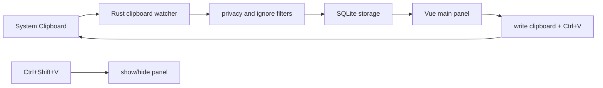

# Architecture

Clipboard Lite is split into an open-source core and optional closed-source Pro plugins.

## Runtime Flow

## Open Core

- `src/`: Vue 3 UI, Pinia stores, settings, search, favorites.
- `src-tauri/src/clipboard.rs`: clipboard polling and paste helpers.
- `src-tauri/src/storage.rs`: SQLite schema, dedupe, retention, CRUD.
- `src-tauri/src/hotkey.rs`: global shortcut registration.
- `src-tauri/src/license.rs`: offline license file validation.
- `src-tauri/src/plugin_loader.rs`: dynamic Pro plugin ABI loader.

## Local Data

The app writes only to Tauri's app data directory:

- `config.json`: settings.
- `clipboard.db`: SQLite clipboard history.
- `license.enc`: AES-GCM encrypted local license.

The install directory is never used for user data.

## Clipboard Types

- Text: stored as plain UTF-8 text.
- Files: stored as a JSON array of absolute file paths.
- Images: stored as JSON containing width, height, and base64 RGBA bytes.

Records are deduplicated with `SHA256(clip_type + NUL + content)`. Copying existing content updates its timestamp instead of inserting a duplicate row.

## Privacy Filters

The MVP applies local heuristics before recording:

- ignores configured window/program title fragments;
- skips active window titles that look like password managers or login/password screens;
- limits large text and image payloads to avoid runaway memory/disk usage.

## Pro Boundary

The core never links Pro source code. It only attempts to load a dynamic library from bundled resources after `license.enc` validates on the current device. Missing, unauthorized, or incompatible plugins are skipped without blocking the core app.
